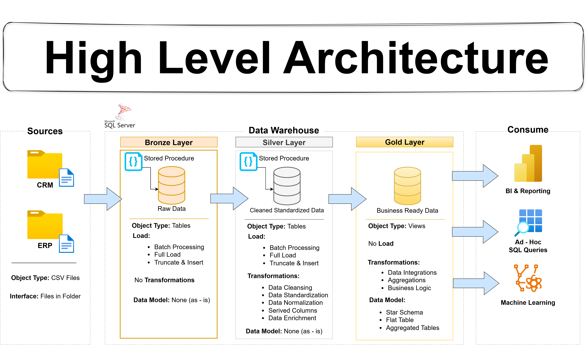
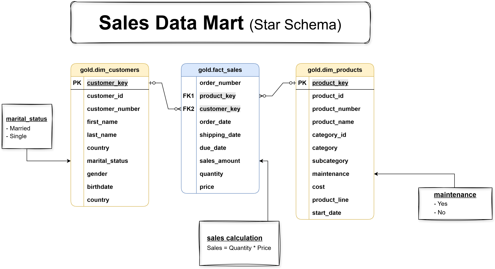

# SQL Data Warehouse Project: CRM & ERP Integration

**Building a modern Data Warehouse with SQL Server, SSIS, and Stored Procedures.**

## 📌 Project Overview
In this project, I built a Data Warehouse from scratch to integrate disparate data from a **CRM system** and an **ERP system**. The goal was to transform raw, messy data into a clean, actionable Star Schema for business intelligence.

*(High-Level Architecture: Bronze, Silver, and Gold Layers)*

## 🏗️ Architecture & Layers
The project follows the **Medallion Architecture** (Bronze, Silver, Gold) to ensure data quality and traceability.

### 🥉 Bronze Layer (Raw Ingestion)
* **Purpose:** Acts as a landing zone for raw data files (CSV) from the source systems.
* **Process:** Data is ingested "as-is" without transformation.
* **Load Type:** Full Load (Truncate & Insert) using Batch Processing.
* **Sources:**
    * **CRM Data:** Sales details, customer info, product info.
    * **ERP Data:** Customer demographics (birthdays), product categories, location data.

### 🥈 Silver Layer (Transformation & Quality)
* **Purpose:** The cleaning and standardization engine.
* **Transformations:**
    * **Standardization:** Unified naming conventions and date formats across CRM and ERP sources.
    * **Data Cleansing:** Handled NULL values, removed duplicates, and corrected invalid entries.
    * **Integration:** Merged customer and product tables from both sources into unified datasets.
    * **Automation:** Implemented via **SQL Stored Procedures** for repeatable transformations.

### 🥇 Gold Layer (Business Reporting)
* **Purpose:** The final layer optimized for BI and Analytics.
* **Structure:** **Star Schema** (Fact & Dimension tables).
* **Data Mart:**
    * **Fact Table:** `gold.fact_sales` (Transactions, Quantities, Revenue).
    * **Dimensions:** `gold.dim_customers` (Who bought it), `gold.dim_products` (What was bought).
* **Outcome:** Ready for consumption by tools like Power BI or Tableau.

## 📊 Data Model (Star Schema)
The final data model is designed for high-performance querying and reporting.

## 🛠️ Tech Stack
* **Database:** SQL Server Express
* **ETL & Orchestration:** SQL Stored Procedures
* **Design & Modeling:** Star Schema / Dimensional Modeling
* **Version Control:** Git & GitHub

## 📄 License
This project is licensed under the MIT License.

## 👤 About Me
This is part of my Data Engineering portfolio. I am passionate about building scalable data pipelines and mastering the modern data stack.
